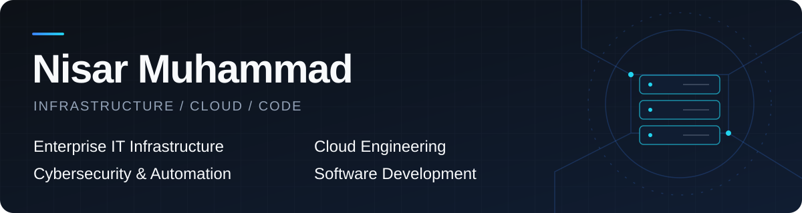

  

**Senior IT Infrastructure & Systems Administrator | Cloud & Microsoft 365 Engineer | Full-Stack Developer**

I bring **20+ years in IT**, including **13+ years supporting enterprise infrastructure in UAE higher education**. I connect infrastructure operations with practical software engineering to build secure, maintainable systems and business applications that improve everyday work.

Professional positioning reflecting experience and areas of practice.

## About Me

- Design and administer enterprise infrastructure across Windows Server, Active Directory, Hyper-V, and virtualization.
- Work across Microsoft Azure, Microsoft 365, and Entra ID, connecting cloud services with identity administration.
- Support enterprise networking, cybersecurity, backup, disaster recovery, and infrastructure monitoring.
- Build PowerShell automation and business applications, bringing an operator's understanding of reliability and support into software design.

## Technology Stack

### Cloud & Identity

  

Exchange Online · Active Directory · Group Policy

### Infrastructure & Virtualization

  

Failover Clustering · Enterprise Storage

### Networking & Security

  

VLANs · Firewalls · MFA · Conditional Access

### Software Development

   

.NET · REST APIs · JavaScript · HTML · CSS

### Databases & Tools

  

Git · GitHub · Visual Studio · VS Code

## Microsoft Certifications

**Awarded certifications**

| Certification | Exams passed | Status |
| :--- | :--- | :--- |
| [Microsoft Certified: Azure Administrator Associate](https://learn.microsoft.com/en-us/credentials/certifications/azure-administrator/) | AZ-104 | Awarded · Active |
| Microsoft Certified: Windows Server Hybrid Administrator Associate | AZ-800 + AZ-801 | Awarded |

**Passed exam**

- **MS-102: Microsoft 365 Administrator** — Passed. The [Microsoft 365 Certified: Administrator Expert](https://learn.microsoft.com/en-us/credentials/certifications/m365-administrator-expert/) credential requires a qualifying prerequisite certification; award status is not claimed here.

<!-- Owner-confirmed certification and exam status. No credential IDs or verification links are published. Preserve the Windows Server credential title as awarded, even if the current Microsoft path is renamed. -->

**Continuing professional development:** Ongoing learning in hybrid cloud, identity security, infrastructure automation, and modern .NET and React application development.

## Featured Projects

### 01 / YouTube MP3 Downloader

**Public repository · Windows desktop application**

A desktop audio downloader with multi-link batch downloads, queue management, up to five concurrent downloads, a built-in MP3 player, and an optional Chrome companion extension. Includes light and dark themes and configurable MP3 quality.

[Explore the repository](https://github.com/nisarnis-prog/youtube-mp3-downloader) · [More application screenshots](https://github.com/nisarnis-prog/youtube-mp3-downloader#application-screenshots)

### 02 / Enterprise IT Asset Management Platform

> **Private / internal case study · Asset accountability**
>
> Asset registration and lifecycle management with digital assignment and return workflows. Automated official handover and return documents, signature collection, IT verification, management approval, and role-based access control support a traceable process.

### 03 / Enterprise Infrastructure Monitoring Platform

> **Private / internal case study · Operational visibility**
>
> Centralized server and network device monitoring covering availability, performance, CPU, memory, and storage. Automated incident and recovery notifications support infrastructure operations.

### 04 / Enterprise ERP Development

> **Private / internal case study · Modular application design**
>
> Experience designing business applications across CRM, HR, Finance, Procurement, Inventory, and Asset Management. Development is modular and ongoing; module maturity varies.

### 05 / Automation and IT Solutions

> **Private / internal case study · Practical workflow improvements**
>
> PowerShell automation for identity lifecycle administration, reporting, and recurring operational workflows, connecting infrastructure knowledge with maintainable tools.

## GitHub Statistics

Programming languages in public repositories

Language distribution reflects a small public code sample and does not measure overall professional expertise.

Cards are generated by an external service and may be cached or temporarily unavailable. View [contribution activity](https://github.com/nisarnis-prog?tab=overview) and [public repositories](https://github.com/nisarnis-prog?tab=repositories) directly on GitHub.

## Professional Links

[GitHub / nisarnis-prog](https://github.com/nisarnis-prog)

<!-- TODO: LINKEDIN_URL — add only a verified public profile belonging to Nisar Muhammad. -->
<!-- TODO: PORTFOLIO_URL — add only an owner-approved public website. -->
<!-- TODO: CONTACT_EMAIL — publish only after the owner confirms the address is intended for public use. -->

Reliable infrastructure. Practical software. Thoughtful automation.

